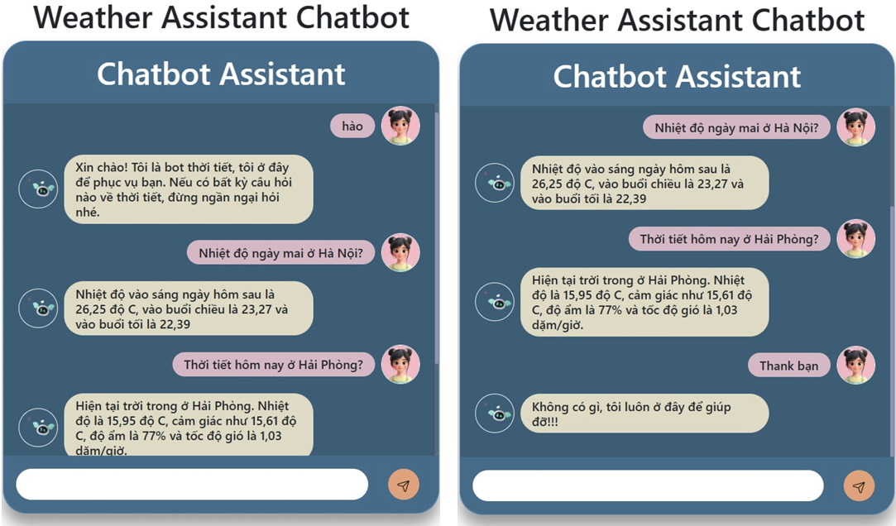

# Vietnamese Weather Chatbot using Rasa

Chatbot hỏi đáp thời tiết bằng **tiếng Việt** được xây dựng bằng framework **Rasa**.  
Hệ thống có khả năng hiểu câu hỏi tự nhiên của người dùng và cung cấp thông tin thời tiết thông qua **Weather API**
---

# Project Overview

Mục tiêu của dự án là xây dựng một chatbot có thể trả lời các câu hỏi liên quan đến **thời tiết tại các thành phố ở Việt Nam**.

Ví dụ các câu hỏi chatbot có thể xử lý:

- "Thời tiết Hà Nội hôm nay thế nào?"
- "Ngày mai ở Đà Nẵng có mưa không?"
- "Dự báo thời tiết TP.HCM 3 ngày tới"

Quy trình hoạt động của hệ thống:

1. Người dùng nhập câu hỏi
2. Hệ thống phân tích câu hỏi bằng **Rasa NLU**
3. Xác định **Intent** (ý định của người dùng)
4. Trích xuất **Entities** (ví dụ: địa điểm, thời gian)
5. Gọi **Weather API**
6. Trả về câu trả lời cho người dùng

---

# System Architecture

Hệ thống chatbot bao gồm hai thành phần chính:

## 1. Rasa NLU

Rasa NLU có nhiệm vụ **hiểu câu hỏi của người dùng**.

Pipeline xử lý gồm các bước:

- **Tokenizer** – tách câu thành các token
- **Featurizer** – chuyển văn bản thành vector đặc trưng
- **Intent Classifier** – xác định mục đích của câu hỏi
- **Entity Extractor** – trích xuất thông tin quan trọng

Các thành phần chính được sử dụng:

- `Underthesea` 
- `CountVectorsFeaturizer`
- `DIETClassifier`

---

## 2. Rasa Core

Rasa Core chịu trách nhiệm **quản lý hội thoại** và quyết định phản hồi phù hợp.

Các thành phần chính:

- **Domain** – định nghĩa intents, entities và responses
- **Stories** – các kịch bản hội thoại
- **Rules** – các luật phản hồi
- **Policies** – thuật toán lựa chọn hành động tiếp theo

---

## 3. Weather API Integration

Chatbot sử dụng **OpenWeather API** để truy vấn dữ liệu thời tiết.

Thông tin có thể lấy được:

- Thời tiết hiện tại
- Dự báo thời tiết
- Thông tin thời tiết theo địa điểm

---

# Training Dataset

Dataset được xây dựng thủ công với các câu hỏi tiếng Việt.

## Intents

Một số intents chính:

- `ask_weather`
- `weather_forecast`
- `greet`
- `goodbye`

## Entities

Các entities được trích xuất:

- `location`
- `forecast_period`
- `weather_type`

Ngoài ra hệ thống còn sử dụng:

- **Synonyms**
- **Lookup tables** cho tên thành phố

---

## Demo Chatbot

Ví dụ chatbot trả lời câu hỏi về thời tiết:

## Kết quả đạt được

- Chatbot đạt **~90% accuracy** trong intent classification
- Hỗ trợ trả lời các câu hỏi về **thời tiết theo thành phố**
- Có khả năng **hiểu nhiều cách hỏi khác nhau của người dùng**

## Tech Stack

### Programming Language
- Python

### Framework
- Rasa

### API Integration
- Weather API

### Frontend
- HTML
- CSS
- JavaScript

